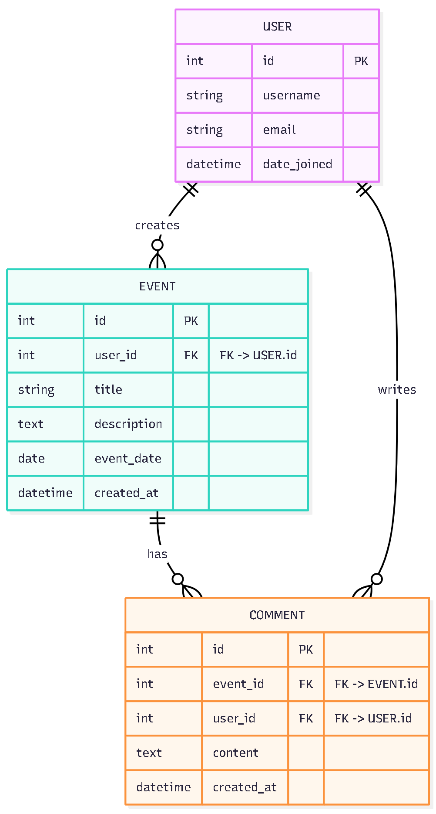

# Capstone-Project
Implemented a complete user authentication system, including sign-up, login, and logout functionalities using Django’s built-in authentication framework.

Designed user-friendly templates for the authentication pages to improve the overall user experience and maintain consistent styling across the app.
